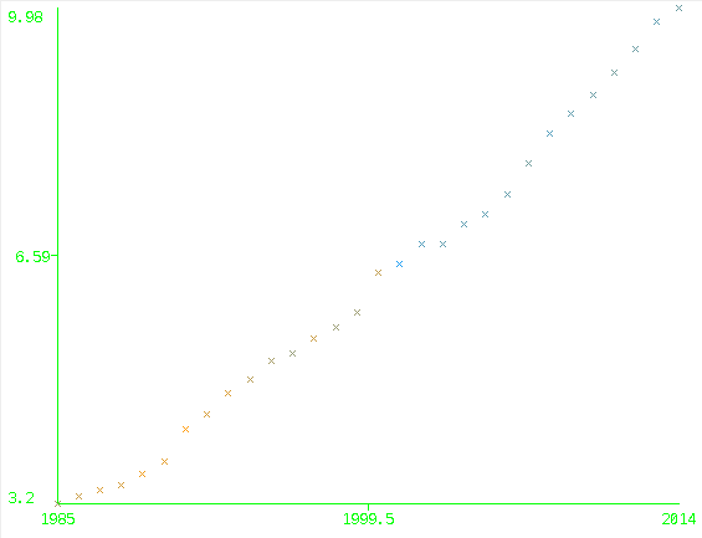

## Intro

> This project is a individual project from [LMU Wintersemester15/16 infomation visualization](http://www.medien.ifi.lmu.de/lehre/ws1516/iv/).
> Github: https://github.com/changkun/OktoberfestIV
>
> Changkun Ou
> Last Update: 04.11.2015

## Datasets

Datasets: [Oktoberfest](https://www.opengov-muenchen.de/dataset/oktoberfest)

* [1.oktoberfest total 19852014](./data/1.oktoberfest total 19852014.csv)
* [2.oktoberfest beer consumption19852014](./data/2.oktoberfest beer consumption19852014.csv)
* [3.oktoberfest bierpreis19852014](./data/3.oktoberfest bierpreis19852014.csv)
* [4.oktoberfest besucher19852014](./data/4.oktoberfest besucher19852014.csv)

This website provide four datasets resoures which is about the beer prices, the number of visitors' situation changes in the Oktoberfest from 1985 to 2014.

In fact, the other three data sets of data have been included in the first data set.

So we only study in [the first dataset](./data/1.oktoberfest total 19852014.csv).

The first dataset file contains 8 features and there are:

- Year
- Duration
- Totial vistors
- Visitors per day
- Beer price
- Beer consumption
- Chicken price
- Chicken consumption

## Tools

Analysising tool contains but not limited to:

* D3.js

> D3.js is a JavaScript library for manipulating documents based on data. D3 helps you bring data to life using HTML, SVG, and CSS. D3’s emphasis on web standards gives you the full capabilities of modern browsers without tying yourself to a proprietary framework, combining powerful visualization components and a data-driven approach to DOM manipulation.

## Concepts and Research Problems

This project will demonstrate but not limited to:

- **Data Pattern**: What is the relationship bwteen two or more different variables? Which means how to cluster or regression these features?
- **Modeling**: Is there any potential model inside the data such that we can use it to predict the future?
- **Prediction**:  And find a method and applying them for the model to predict features.

For example:

Obviously we can see the pattern inside the year and beer price which shows us the beer price are increasing year by year.

These topics will be discussed in detail in the feature. 

## Licencs

Licensed [BY-NC-SA Creative Commons]
(http://creativecommons.org/licenses/by-nc-sa/4.0/).