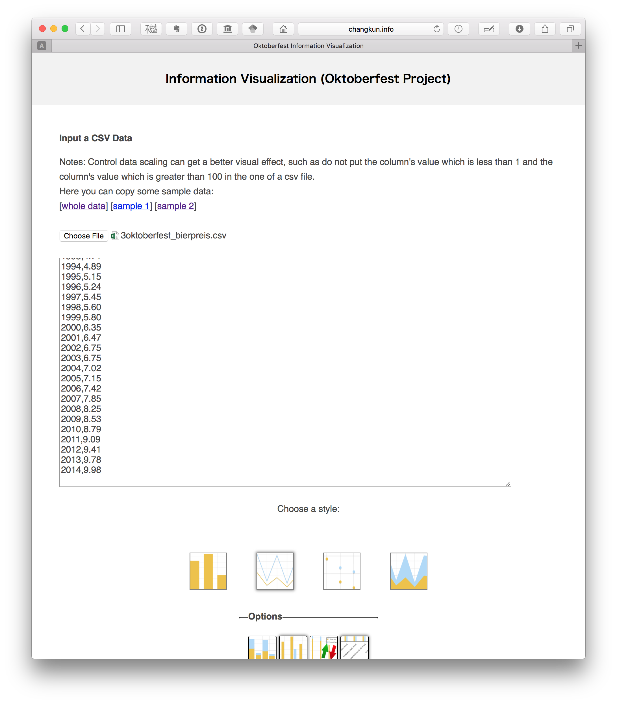

## Intro

> This project is a individual project from [LMU Wintersemester15/16 infomation visualization](http://www.medien.ifi.lmu.de/lehre/ws1516/iv/).
> 
> Github: [https://github.com/changkun/OktoberfestIV](https://github.com/changkun/OktoberfestIV)
> Tool Site: [http://changkun.info/iv/](http://changkun.info/iv/)
>
> Changkun Ou
> 
> Student Number: 11406972
> 
> Last Update: 07.12.2015

## Datasets

Datasets: [Oktoberfest](https://www.opengov-muenchen.de/dataset/oktoberfest)

* [1.oktoberfest total](./src/data/1oktoberfest_total.csv)
* [2.oktoberfest beer consumption](./src/data/2oktoberfest_beer_consumption.csv)
* [3.oktoberfest bierpreis](./src/data/3oktoberfest_bierpreis.csv)
* [4.oktoberfest besucher](./src/data/4oktoberfest_besucher.csv)

This website provide four datasets resoures which is about the beer prices, the number of visitors' situation changes in the Oktoberfest from 1985 to 2014.

In fact, the other three data sets of data have been included in the first data set.

So we set the other dataset as a sample use in our InfoVis Tool.

The first dataset file contains 8 features and there are:

- Year
- Duration
- Totial vistors
- Visitors per day
- Beer price
- Beer consumption
- Chicken price
- Chicken consumption

## Challenges

1. Use framework for development need to overcome technical difficulties;
2. Time series data does not seem much to visualize concepts.
3. Data and features are few and far between.

## Tool & Features Description

Thirdparty:

* jQuery

The [Tool](./src) can be visit at: [http://changkun.info/iv/](http://changkun.info/iv/).
We provide the whole dataset, and two more sample data for you.

We developed four graph type:

* Column Graph
* Line Graph
* Points Graph
* Area Graph

and here are for option to change what the graph like:

* Stack Graph
* Unstack Graph
* flip the data
* route the X axis label (make sure it can be look over)

As result, user can

* input data as a CSV format
* select local CSV data file as input
* edit the graph title
* change the axis label

Here is what the site like:

## Concepts and Open Problems

This project have some interesting problem but not limited to:

- **Data Pattern**: 
  - What is the relationship bwteen two or more different variables? 
  - How to cluster or regression these features?
- **Modeling**: 
  - Is there any potential model inside the data such that we can use it to predict the future?
- **Prediction**:  
  - Find a method and applying them for the model to predict features.
  - What kind of conclusion can we find?

For example:

Obviously we can see the pattern inside the year and beer price which shows us the beer price are increasing year by year.

Here is another example:

**These topics is open and depends on how we modeling a mathematic model.** 

*Enjoy it! :)*
## Licencs

Licensed [BY-NC-SA Creative Commons]
(http://creativecommons.org/licenses/by-nc-sa/4.0/).